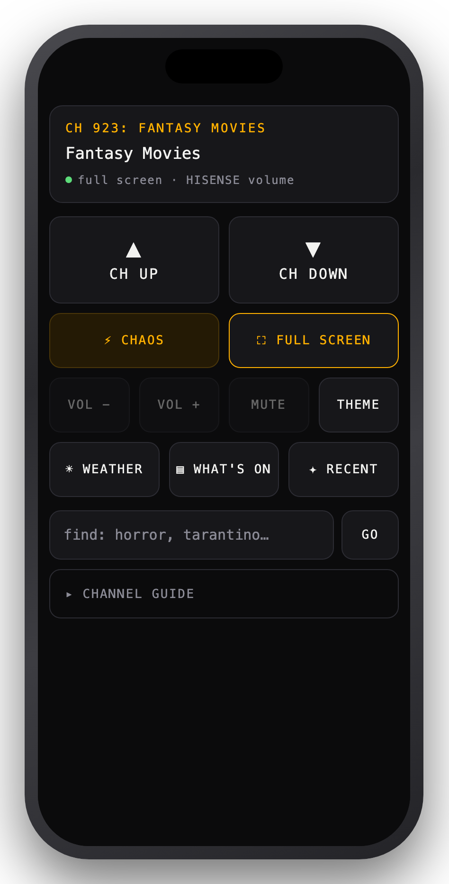
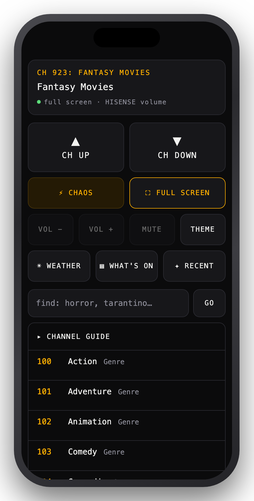

# coax-remote

Turn your phone into a remote for [Coax](https://apps.apple.com/app/id6752622762) running on
a Mac. Channel up/down, shuffle, full screen, jump to any channel, and a tappable
channel guide — served from the Mac itself, so there's no app to install.

Add it to your Home Screen and it launches chrome-less, like a native remote.

<p align="center">
  
  &nbsp;&nbsp;
  
</p>

Above: the remote running as a Home Screen web app on an iPhone. On the left, the
status panel shows what's on and the volume keys are greyed out — this Mac feeds a
TV over HDMI, which owns its own volume (see [caveats](#notes-and-caveats)). On the
right, the channel guide: every channel Coax generated, tap to tune.

```
iPhone ──http──▶ Hammerspoon ──menu bar──▶ Coax
```

Coax has no scripting interface and its window is a single Metal-drawn view with
no accessible controls, so this drives the app the only stable way there is: its
**menu bar**, via `hs.application:selectMenuItem`. Channel up/down are arrow keys.

## What you get

A web remote (the main thing), plus two other ways in — all on one dispatcher:

| Front end | How | Good for |
|---|---|---|
| **Web** | `http://your-mac:8765` | the remote itself; add to Home Screen |
| **CLI** | `coax full`, `coax ch 113` | Shortcuts over SSH → Siri, Action Button, widgets |
| **File** | `echo u > /tmp/coax_cmd` | anything that can write a file |

### Commands

| Command | Does |
|---|---|
| `u` / `d` | channel up / down |
| `scrn [on\|off]` | the stream panel full screen — Coax's own **FULL SCRN** |
| `full [on\|off]` | the app *window's* full screen — a different axis, see below |
| `ch <n>` | tune to a channel number |
| `find <text>` | tune to the first channel matching text — `find horror`, `find tarantino` |
| `chaos [category]` | random channel, never the one already on |
| `cat <category>` | first channel of a category |
| `weather` / `whatson` / `recent` | the one-off channels |
| `list [category]` | the guide, as text |
| `theme [retro\|modern]` | switch theme |
| `wt` / `multi` | Watch Together / Multi-Window |
| `vol <up\|down\|0-100>` / `mute` | system output volume — see the caveat below |
| `status` | what's on, both full screen states, volume |
| `open` / `quit` | launch / quit Coax |
| `screenoff` | put the display to sleep |
| `help` | the list above |

Categories: Genre, Studio, Decades, Recents, Director, Collections, Actors, Now
Playing, Weather — matched loosely, so `nowplaying`, `now playing` and `now` all
work. Aliases exist for the obvious alternatives (`up`, `next`, `fs`, `shuffle`,
`tune`, `guide`, `power`, `sleep`, …).

### Two full screens

Coax has two of them and they are independent, which is worth knowing before you
wonder why one button doesn't do what you meant:

- **`scrn`** — the *stream panel*. The guide plays its stream in a pane beside the
  EPG; this hands the whole app view to the player. It's the one you want while
  watching, and it's the app's own on-screen `FULL SCRN` button.
- **`full`** — the *app window*, against the desktop. On a TV you set this once and
  never touch it again.

They're easy to conflate because Coax labels both "Enter Full Screen" in the
accessibility layer — the menu item resizes the window, the HUD button resizes the
panel. Entering `scrn` presses that button (there is no menu item and no key
shortcut for it); leaving sends Escape, which works even after the player's HUD has
auto-hidden and taken the button with it.

On the phone remote both live on one key: **tap** for the panel, **hold** for the
window. A hold rather than a double-tap deliberately — the panel takes a moment to
swap, and the instinct when a press looks like it missed is to press again, which
under a double-tap scheme would fire the rare command at exactly the wrong moment.

## Install

Requires [Hammerspoon](https://www.hammerspoon.org/) and Coax.

```sh
git clone https://github.com/bisacciamd/coax-remote.git
cd coax-remote

# Hammerspoon loads modules from ~/.hammerspoon
ln -s "$PWD/coax.lua"         ~/.hammerspoon/coax.lua
ln -s "$PWD/coaxweb.lua"      ~/.hammerspoon/coaxweb.lua
ln -s "$PWD/coax-remote.html" ~/.hammerspoon/coax-remote.html
ln -s "$PWD/bin/coax"         /usr/local/bin/coax      # optional CLI
```

Add to `~/.hammerspoon/init.lua`:

```lua
coax = require("coax").start()
```

Then **grant Hammerspoon Accessibility** in System Settings → Privacy & Security
→ Accessibility. This is the step everything depends on: it's what lets
Hammerspoon read Coax's menus. (Hammerspoon is signed, so the grant sticks —
an ad-hoc AppleScript helper loses it on every rebuild.)

Reload the config. You'll see a `Coax remote loaded` alert, and the token is
generated into `~/.hammerspoon/coax-token`.

### Get the URL onto your phone

```lua
-- in the Hammerspoon console
coax.web.url("your-mac.local")
```

Open that in Safari on the phone → Share → **Add to Home Screen**. The token is
carried in the bookmark, so you never type it.

### Options

```lua
coax = require("coax").start({
  port       = 8765,
  interface  = nil,          -- "localhost" to refuse anything off-machine
  extraHosts = { "tv-mac" }, -- extra hostnames you reach it by (see Security)
  web        = true,
  alert      = true,
})
```

## Security

This hands whoever reaches it control of your Mac, so:

- **Token on every route**, as `?t=` or an `X-Coax-Token` header. Generated on
  first run into `~/.hammerspoon/coax-token` (chmod 600, 128 bits), compared
  without early-exit, and never expires — your bookmark keeps working across
  restarts.
- **The token is scrubbed from the address bar.** The page stashes it in
  `localStorage` and `replaceState`s it out of the URL, so it doesn't linger in
  browser history — or in a screenshot you post somewhere.
- **DNS-rebinding guard.** Requests whose `Host` is a real domain are refused; a
  browser only ever reaches this by IP, `localhost`, `.local` or a tailnet name.
  Add your own names via `extraHosts`.
- **It is plain HTTP on your LAN.** Anyone already sniffing that segment can read
  the token. Treat it as house-key-grade, not password-grade. If you want it
  off-LAN, put it on [Tailscale](https://tailscale.com/) rather than forwarding a
  port.
- Commands run from a fixed dispatch table — no shell is constructed from input.

## Notes and caveats

**Volume may do nothing, and that's macOS.** If your Mac outputs to a TV over
HDMI/DisplayPort, macOS exposes no software volume for it — `outputVolume()`
returns `nil` and the set runs its own mixer. The remote detects this, greys the
volume keys out and says which device is in charge, rather than reporting a level
it can't change. On built-in speakers it works normally.

**Haptics: one tick, and only on iOS 17.4+.** WebKit never shipped
`navigator.vibrate`, and iOS 26.5 patched the scripted-haptic trick, so a web
page gets a single fixed system tick and no control over intensity. Each key
carries an invisible `<input type="checkbox" switch>` (clipped with `clip-path`,
which clips hit-testing) so your finger lands on a real control and iOS ticks.
Per-button *feels* only materialise where `navigator.vibrate` exists (Android);
elsewhere the difference is carried by the press animation.

**Channel titles go stale.** Menu titles embed the current programme
(`CH 113: Horror - Nope (6:45PM-9PM)`), so a lookup refetches the menus and
retries once. That's why an occasional command takes a beat longer.

**Double-tap zoom** is disabled with `touch-action: manipulation`; pinch-zoom is
deliberately left working.

Every command and reply is logged to `/tmp/coax_log`.

## API

| Route | Returns |
|---|---|
| `GET /api/status` | `{running, channel, num, name, panel, full, infoShown, device, volume, muted, canVolume}` |
| `GET /api/guide` | `[{num, name, cat, now}, …]` — `&fresh=1` bypasses the menu cache |
| `GET /api/cmd?c=<cmd>` | `{reply, state}` |

`status` and `guide` never focus Coax, so polling them won't yank the app forward
while you're using the Mac.

### Dashboard tile (Homepage)

```yaml
- Media:
    - Coax:
        icon: mdi-television-classic
        href: http://YOUR-MAC-IP:8765/?t={{HOMEPAGE_VAR_COAX_TOKEN}}
        siteMonitor: http://YOUR-MAC-IP:8765/api/status?t={{HOMEPAGE_VAR_COAX_TOKEN}}
        widget:
          type: customapi
          url: http://YOUR-MAC-IP:8765/api/status?t={{HOMEPAGE_VAR_COAX_TOKEN}}
          refreshInterval: 10000
          mappings:
            - field: channel
              label: On air
            - field: name
              label: Channel
```

with `HOMEPAGE_VAR_COAX_TOKEN` in Homepage's `.env`. `customapi` fetches
server-side, so the container has to be able to reach the Mac.

## Not built

- The Chaos shuffle channel, Stream Options and the sleep timer are on-screen
  remote buttons that the accessibility tree doesn't expose. Reaching them would
  need image-matched clicking, or keyboard shortcuts from the developer.
- TV volume would need HDMI-CEC hardware or the set's own network remote.

## Licence

MIT — see [LICENSE](LICENSE).

Not affiliated with Coax or its developer. Coax is lovely; go buy it.
